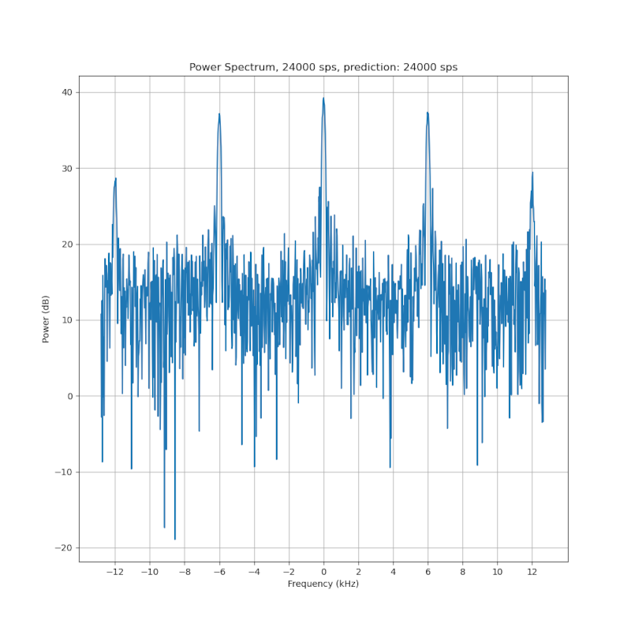
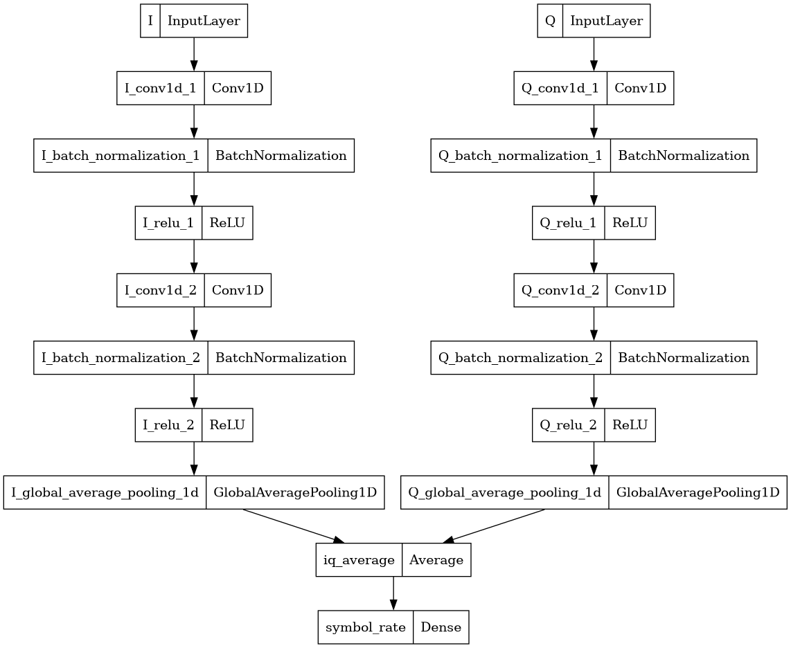

# MSK Symbol Rate Classification with Tensorflow

tl;dr A neural network to detect minimum-shift keying synchronization preambles and decide on the received
symbol rate.

## Dependencies
- [Tensorflow 2](https://www.tensorflow.org/install)
- [Keras](https://keras.io/getting_started/) (generally packaged with Tensorflow)
- [Python 3](https://www.python.org/downloads/)
- [Matplotlib](https://matplotlib.org/stable/users/getting_started/) (only for generating example plots of
  classifications)
- [MATLAB](https://www.mathworks.com/products/matlab.html) (only for training data generation)

---

## Signal Processing Theory

### Minimum-Shift Keying
[Minimum-shift keying](https://en.wikipedia.org/wiki/Minimum-shift_keying) (MSK) is a digital modulation
scheme that employs frequency shifts to convey data bits.  One way of conceiving of the waveform is that it is
a type of binary [continuous-phase frequency shift
keying](https://en.wikipedia.org/wiki/Continuous_phase_modulation#Continuous-phase_frequency-shift_keying)
(CPFSK).  This means that its symbol alphabet is size 2, with a -1 and a +1 symbol conveying a 0 bit and a 1
bit respectively. In binary frequency-shift keying, a modulation index is chosen, which is generally a
rational number — for example, 2/5. Modulation index is often denoted as 'h'. This 'h' represents the digital
frequency of the symbols; for h=2/5, the symbols have a frequency of 2π/5 radians per symbol. Given the symbol
rate, we can then derive the physical frequency of the symbols at baseband; for h=2/5 and a symbol rate of
5000 symbols per second, the frequency of the symbols is given by `((2π / 5) * 5000) / 2π = 1000 Hz`. A -1
symbol would thus be a tone at -1000 Hz, and a +1 symbol a tone at 1000 Hz.

The 'continuous phase' portion of CPFSK simply means that the transmitter should use a single sinusoid at
baseband and only change its frequency, rather than switching between two sinusoids of different phases and
frequencies. This generally happens 'for free' in a digital modulator anyway due to the techniques typically
used in a digital modulator (use of a numerically controlled oscillator), so CPFSK is the 'natural' form of
digital FSK.

Minimum-shift keying is simply the specific case of CPFSK with a modulation index equal to 1/2. This index
gives it considerable robustness to noise; over each symbol period, the carrier phase shifts by 90 degrees,
which is comparable to QPSK, but because it does not have abrupt phase discontinuities, it has better
adjacent-channel emissions properties.

### MSK Automatic Symbol Rate Detection
In bursty communications systems, it is often desirable to have a synchronization preamble preceding the data
payload of the burst to allow the receiver to recover the phase, frequency, and symbol timing of the carrier
before data arrives. Often, the symbol rate is known a priori to the receiver; however, this is not always the
case. In some situations, it is desirable for the transmitter to be able to change the symbol rate
adaptively — for example, to increase or decrease the symbol rate based on how noisy the communications
channel is in order to minimize errors.

A variable symbol rate adds an extra variable that the receiver must solve for during acquisition; however,
careful selection of a synchronization pattern using MSK modulation yields a synchronization preamble that
allows all 4 variables to be solved for using a discrete Fourier Transform. A bit pattern of `1100`, repeated
for a suitable duration, yields a signal with a unique spectral signature, an example of which is shown below:

The signal contains a strong center tone at DC, with two primary sidetones offset from DC by 1/4th of the
symbol rate in Hz; e.g. for a symbol rate of 8000 symbols per second, the first two sidetones lie at +/- 2000
Hz. Further sidetones exist at multiples of 1/2 the symbol rate, but these tones are not necessary for
acquisition and are considered more of a nuisance than anything. Recovery of the symbol rate can clearly be
done by exmaining the frequency spectrum and determining the distance of the two sidetones from DC.
Frequency, phase, and timing can be recovered by examining the position of the signal within the DFT spectrum
and the phase of the complex exponentials corresponding to the 3 primary tones.

Unfortunately, if the length of the preamble is a constant number of symbols (meaning it becomes shorter in
time as symbol rate increases), detection and estimation becomes a tricky problem, especially if there is a
wide variation in symbol rates. A discrete Fourier transform has significant tradeoffs between time and
frequency resolution; a shorter input signal yields poorer frequency resolution, while sampling a longer
period of time yields poor resolution in time; at high symbol rates, the entire preamble may be less than the
DFT window, which means that the DFT will necessarily contain some noise or some data, which pollutes the
estimation process. Selecting the ideal length of DFT window for the possible symbol rates that can be
received and determining the heuristics needed to select which DFT bins contain the tones of interest is thus
fairly difficult.

Therefore, this project examines the possibility of using a neural network to learn to detect and classify MSK
synchronization preambles with different symbol rates. By using gradient descent to learn the optimal
heuristics to classify the signal, the engineering task of trying to design a DFT-based classifier and
estimator is obviated.

## Training Data
Training data for this project has been artificially generated with MATLAB using the scripts available in the
`training_data_generation` folder of the repository. Simply run `export_examples.m` to generate a dataset
similar to the one used to train the model.

The dataset is configured to contain 50000 examples of burst acquisition scenarios. Each scenario contains
1,024 complex single-precision floating point baseband samples at a sample rate of 25,600 Hz, as well as the
relevant signal characteristics (phase, frequency, and time offsets, and signal-to-noise ratio, as well as the
symbol rate). 20% of the scenarios contain only noise, to train the model to detect signal absence. The
remaining 80% contain a uniform distribution of 7 symbol rates, with randomly generated phase offsets, time
offsets, frequency offsets between -1600 and 1600 Hz, and a signal-to-noise ratio between -1 dB and 25 dB.
These parameters can be tuned in `generate_example.m` as desired.

This data set assumes the signal is received over an AWGN channel, e.g. a satellite downlink. Due to
resampling, the signal is lowpass-filtered, which causes the time series to distort slightly, but the primary
frequency content of the signal is not affected, and thus, classification should ideally not be affected at
all by this. Each example represents the same duration of time — 40 ms — and is based on the idea that the
receiver knows approximately when the burst will start but not exactly. The receiver simply buffers a
sufficient backlog of samples and then runs the classifier on the backlog each time it fills until it gets a
positive hit.

The training data is exported as a JSON-formatted Tensorflow TFRecord. Once generated, the JSON can be
converted to a binary TFRecord using the supplied `training_data/json_to_tfrec.py` script. This process only
needs to be done once. The script produces a `.tfrec` file which can then be consumed by the training script.

## Model Training
The structure of the model is defined in `model_training/model_definition.py`. It is based on the time series
classifier presented [here](https://keras.io/examples/timeseries/timeseries_classification_from_scratch/), but
modified in two ways: one copy of the 3-step sub-layers is removed to simplify the model, and it is augmented
to accept complex inputs instead of a real signal. The I and Q channels of the complex baseband signal are
presented to the model as separate real-valued tensors; a copy of the time series classifier is then run on
each channel separately. The results of the classifier are then combined with an averaging layer, and then fed
into a final densely-connected layer that estimates the probability of each symbol rate. This architecture is
shown below:

The model can be trained using `model_training/create_model.py`. Since the model is quite simple, but powerful
enough to handle the classification task, the training converges to quite good accuracy within only 3 or 4
epochs. Training proceeds relatively quickly and can be easily done on even a fairly old desktop GPU (e.g. a
NVIDIA GTX 970). In light of how fast it is, no checkpoints are generated; instead, the model is simply saved
at the end of the training sequence. Additionally, some statistics about the model training are output to a
Tensorboard log directory `tb_logs`, allowing some inspection of the training process.

The training data corpus is split along a 70/15/15 distribution, with 70% used for training. Validation is
performed on each epoch and an evaluation is run at the end of the training process. In general, overfitting
does not seem to be a problem; most likely because the main impediment to classification is high Gaussian
noise in the low signal-to-noise ratio cases, and the classifier can't easily overfit on noise.

A pre-trained model is provided in `models/model.keras`, but again, it only takes a few minutes to train a new
model from scratch to good accuracy. The pre-trained model was trained for 100 epochs and achieves an accuracy
of around 99.9% — this took less than an hour.

## Results

Some example inferences made by the pre-trained model are shown below.

The model achieves better than 99% accuracy and is robust to random frequency, phase, and time offsets in the
signal, as well as very low signal-to-noise ratios; -1 dB is around the minimum necessary to demodulate data
with any kind of acceptable bit error rate.

Computational performance is also quite good; inferences can be run on a NVIDIA GTX 970 in only 10 ms, which
is considerably less than the 40 ms of time each input dataset represents. Thus the model could conceivably
used in a real-time receiver. It is also only 503 kB in size, which could quite comfortably fit in the
constrained memory of an embedded system.

The script `model_training/demonstrate_model.py` was used to generate the example inferences; simply point it
at the desired model to perform a model evaluation and generate some example outputs that can be viewed in
Tensorboard.
